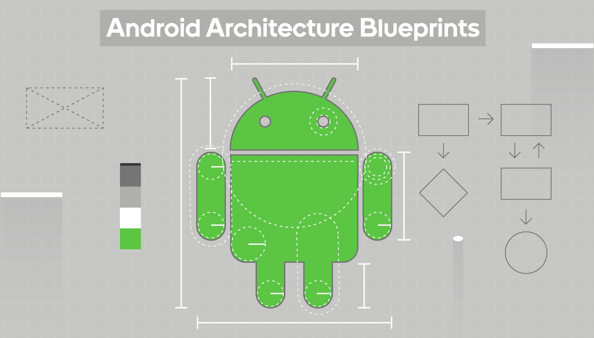
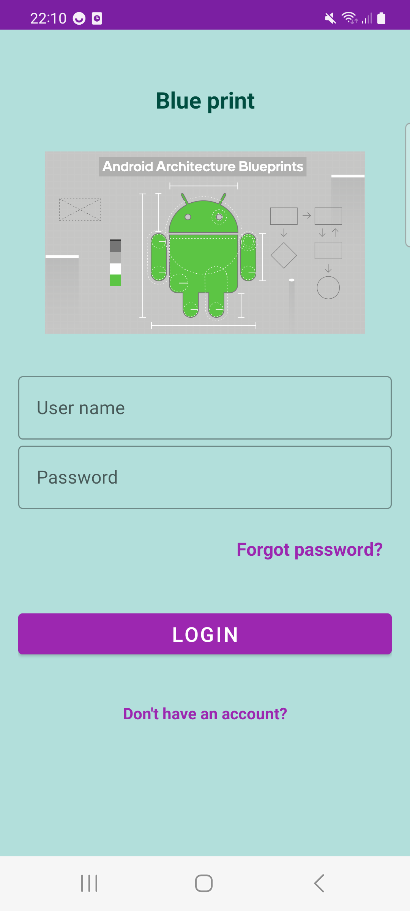

<h1 align="center">Android Blueprints</h1>

<div align="center">
  
</div>
<br>

## Hilt & Modularization

This is an Android project template that implements the Model-View-Intent (MVI) architecture using Kotlin, 
Coroutine flow, Hilt, multi module structure, navigation coordinator, and single activity architecture.

The project is designed to be used as a blueprint for other Android developers who want to start building 
a new app with MVI architecture. It provides a ready-to-use code structure that can be easily extended and modified to fit different app requirements.

## Project Structure

This repository demonstrates an online shopping app that follows best practices for Android development. The app is built using the MVI architecture, Domain use cases, Hilt, single activity architecture, and flow. There are 8 modules in this project:

- `account`: This module is for all the screens that need the user to be authenticated, such as the dashboard, home, user profile, settings, cart, etc.
- `auth`: This module is for user authentication flow, such as login and forgot password.
- `app`: This module is the entry point of the Android app and contains only a splash screen.
- `onboarding`: This module is for user registration flow.
- `core`: This module contains domain model, interface contracts, base classes, shared classes, and utils.
- `navigation`: This module contains all the base classes needed for navigation coordinator pattern.
- `style`: This module has all the shared resources among the other modules, such as styles, colors, theme, drawable, etc.
- `ui-components`: This module contains all the custom UI components to be used by other modules, such as CustomButton, CustomProgressIndicator, etc.

The project is structured using the multi-module architecture approach, which separates different functionalities into individual modules. The following is a brief overview of each module:
- `data` package: The classes inside this package that handles data retrieval from different sources, such as APIs or local databases. It uses Retrofit and Room libraries to implement the data layer.
- `domain` package: The classes inside this package that contains the business logic and domain models of the app. It provides the use cases and repositories that are used by the presentation layer.
- `presentation` package: The classes inside this package that handles the UI and user interactions. It implements the MVI architecture using Coroutine flow and provides the view models and view states that are used by the app.
- `di` package: The classes inside this package that contains all the dagger modules and components which is needed in the module.
- `navigation` package: The classes inside this package that contains navigation flow coordinator and navigation event to break the dependency of ui and navigation components. This help for a clearer structure and also better unit testing the navigation directions.

## Flows
- Account flow: The account module represents it when user is authenticated
- Authentication flow: The auth module represents it when user needs to be authenticated
- User registration flow: The onboarding module represents it when user needs to be registered

<div align="center">
  
</div>

The `app` module only contains a splash screen and decides which flow should be represented to the user based on user authentication status.

## How to use the app
The app is an online shopping app that allows users to browse products, add them to their cart, and make purchases. The app has three main flows:

Account flow: This flow is for users who are already authenticated. It includes screens such as the dashboard, home, user profile, settings, cart, etc.
Authentication flow: This flow is for users who need to log in or reset their password. It includes screens such as login and forgot password.
User registration flow: This flow is for new users who need to create an account. It includes screens such as sign up and verification.
The app uses the MVI architecture, which means that each screen has a corresponding view model that handles state and business logic. The view model communicates with the repository to get data from the server or local database.


## Architecture Overview
The project implements the following architecture:

* Model-View-Intent (MVI): A reactive architecture that separates the view logic from the business logic and data layer. It provides a unidirectional data flow that ensures a predictable and scalable app.
* Hilt: A dependency injection library that provides a simple and efficient way to handle app-level dependencies.
* Domain Use cases: To have a clean code and share the logic in one place.
* Coroutine flow: A reactive programming library that simplifies asynchronous operations and provides a more efficient and concise code.
* Navigation coordinator: A pattern that separates the navigation logic from the view layer and provides a central coordinator that handles the app navigation.
* Single activity architecture: A pattern that uses a single activity and multiple fragments to implement the app UI. This provides a more efficient and flexible way to handle UI navigation and reduces the app complexity.

## Who is it for?

* Intermediate developers are looking for a way to structure their app in a testable and maintainable way.
* Advanced developers looking for quick reference.

## Getting Started
To use this project as a template, follow these steps:

1- Clone the repository:
```bash
git clone https://github.com/mo0rti/android-blueprint-hilt-modularization.git
```
2- Open the project in Android Studio.
3- Modify the project name and package name according to your app requirements.
4- Start implementing your app functionalities using the provided code structure.

## Acknowledgments
This project was inspired by several open-source projects that use the MVI architecture and provide a clean and efficient code structure for Android apps. Special thanks to the following projects:

- [Android MVI Sample](https://github.com/android/architecture-samples) by Google Android Architecture Team

## What's next?

This project is still in progress for Intermediate and advanced Android developers.
There is [another repository](https://github.com/mo0rti/android-blueprint-advanced-modularization) which contains the latest practices for 
multi module projects including feature flags and latest Android navigation patterns.

So Stay tuned!!